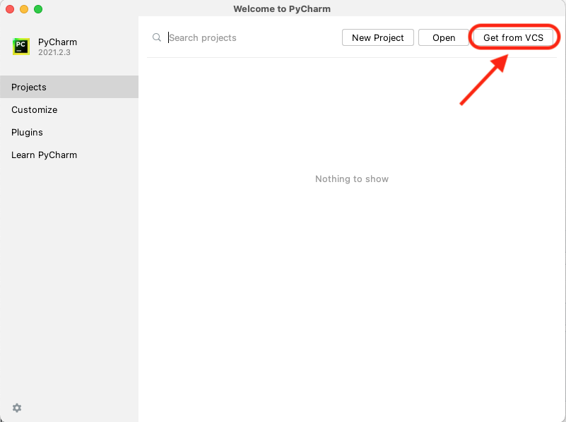
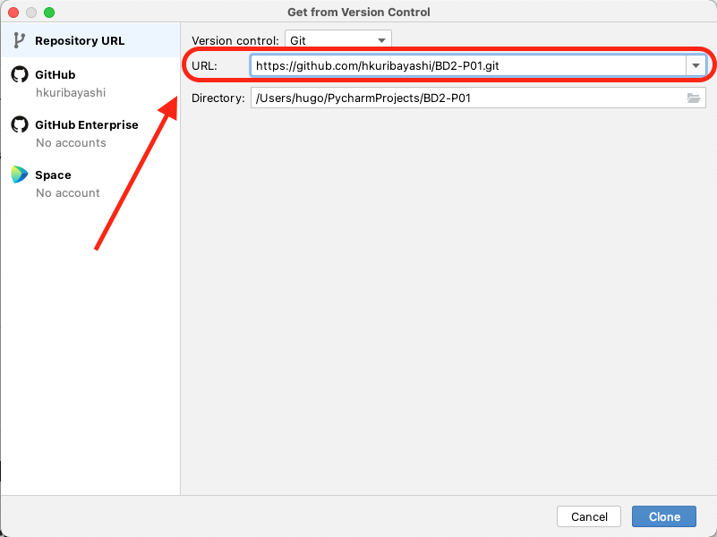
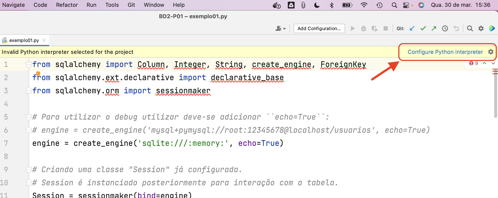
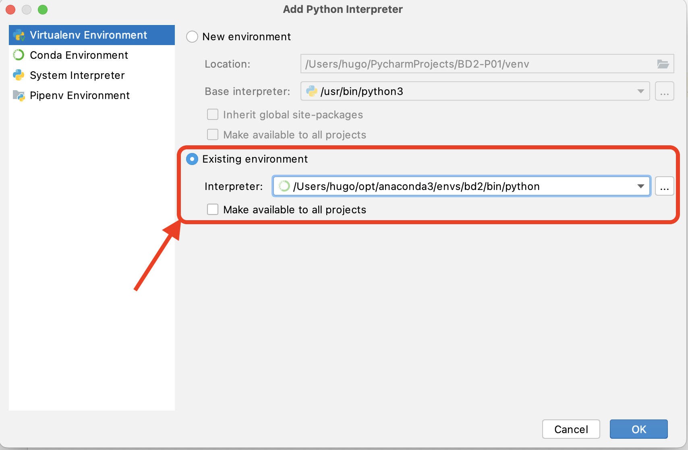

# BD2-P01

# Instruções de como rodar este exemplo

## Instalação de dependências 

### MySQL 

`mysql-server` é um programa gerenciador de Bancos de Dados.

Para "instalar" `mysql-server` no seu computador:

- Faça o download do `mysql-server` [aqui](https://dev.mysql.com/downloads/mysql/)
- Execute o arquivo de instalação
- Durante a instalação será pedido a configuração da senha do usuário `root`
  - Guarde a senha definida
- Verifique se o serviço do `mysql-server` está rodando na porta 3306

### Conda

`conda` é um programa que "monta e gerencia" ambientes, ele não requer privilégios administrativos e não "instala" nada no sistema anfitrião; deletar um ambiente do conda (ou `conda` inteiro) consiste em deletar um diretório.

Para "instalar" `conda` no seu computador:

- Faça o download do `miniconda` [aqui](https://docs.conda.io/en/latest/miniconda.html#windows-installers)
- Execute o script baixado
  - Opcional: modifique o "diretório de instalação"

No site [site oficial](https://docs.conda.io/projects/conda/en/latest/user-guide/install/index.html) há instruções detalhadas.

Após a instalação, feche o terminal e abra novamente.

### Criando o ambiente

Com `conda` instalado, execute (na raiz do projeto) o comando:
`conda env create --name bd2 --file requirements.txt`

Esse comando criará um ambiente chamado `bd2` (você pode renomear se quiser) a partir da lista de pacotes/dependências enumeradas no arquivo requirements.txt (que está na raiz do repositório).

O ambiente é criado no "diretório de instalação" que você configurou durante a instalação do conda.

O resto deste texto assume que o nome do ambiente criado é `bd2`

### Importando o projeto no PyCharm

Com o Pycharm instalado é necessário importar o projeto atual por meio da funcionalidade de VCS, conforme demonstrado abaixo.

Na tela posterior, informar o endereço do projeto: `https://github.com/hkuribayashi/BD2-P01.git`

### Vinculando o Ambiente no PyCharm

Após realizar a importação do projeto, o projeto importado apresentará erros de compilação, dada a falta de um interpretador `Python`.

Conforme exemplo a seguir, siga a opção de configurar um interpretador `Python`, escolhendo a opção `Add Interpreter...`

Na opção `Add Python Interpreter` (conforme exemplo abaixo), escolher a opção `Existing environment` e informar o caminho do ambiente criado nos passos anteriores.

Após a realização das configurações, o projeto estatá pronto para ser executado na opção `Run..`

